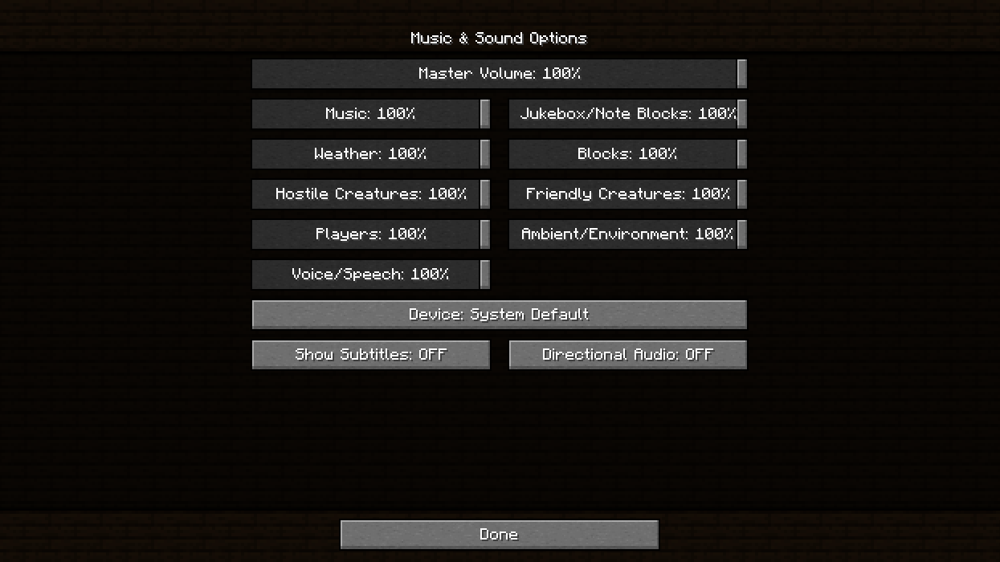

<p align="center">
  
</p>

<p align="center">
    <strong>
        A resource pack generator for Minecraft's menu backgrounds.
    </strong>
</p>

Replace your old dirt-y menu backgrounds with whatever texture you want!

*Bring Your Own Blocks* generates a resource pack from any† square texture, with support for multiple pack formats.

† Textures with side lengths of 1, 2, 4, 8, 16 or 32 pixels work best, but go nuts.

## Examples

### Weathered Copper


### Soul Sand


### Dark Oak Planks


### Faithful 32x Dirt


### Requirements
*Bring Your Own Blocks* requires [Python](https://www.python.org/) (version 3.11 or greater) with the [Click](https://click.palletsprojects.com/) and [Pillow](https://python-pillow.org/) packages installed.

These package requirements can be installed from `requirements.txt` with `pip install -r requirements.txt` or from `Pipfile` with `pipenv install`.

The code linter and formatter [Ruff](https://docs.astral.sh/ruff/) is also included as a development dependency in `Pipfile`, but is not needed.

If you're not sure how to set up your Python environment, I recommend starting with [venv](https://docs.python.org/3/library/venv.html), the standard virtual environment library. Once your virtual environment is activated, run `pip install -r requirements.txt` to install the dependencies.

## Usage
```sh
> python byob.py --help
Usage: byob.py [OPTIONS]

  Generate a resource pack from a texture, targeting the given range of
  resource pack formats.

Options:
  -t, --texture FILE        Texture file  [required]
  -o, --output DIRECTORY    Output folder  [required]
  -m, --min-format INTEGER  Minimum resource pack format to support
  -M, --max-format INTEGER  Maximum resource pack format to support
  --help                    Show this message and exit.
```

The input texture must be a square image, ideally with a side length that is a power of 2 and less than or equal to 32.
This is because all textures are resized to 32x32 using nearest-neighbour interpolation to create the tab sprites.

If you're not sure what pack format you will be using, just don't include the `-m` or `-M` options.
By default, it will generate a pack that attempts to support all versions.

The output folder can be compressed to a `.zip` or left as-is and placed into the Resource Packs folder.

## Attributions
Dark Oak Planks, Soul Sand and Weathered Copper textures from [Minecraft](https://www.minecraft.net).

32x Dirt texture from [Faithful 32x](https://www.faithfulpack.net/).

Bitmgothic font by [Nomi](https://www.thenomi.org/).

## License
*Bring Your Own Blocks* is free and open-source software licensed under the [MIT License](./LICENSE.md).